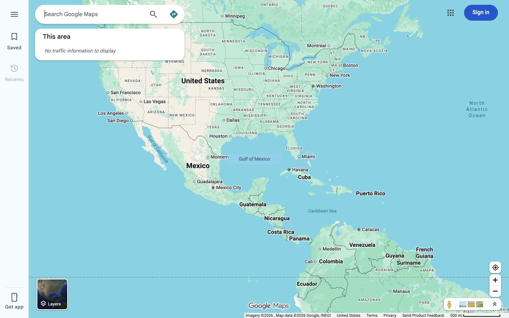

# International Names for Google Maps

A Chrome extension that puts **Lake Ontario** and **Gulf of Mexico** back on Google Maps.

## Why this exists

Two places on Google Maps were renamed for political reasons in the United States. The rest of the world did not go along with it, and neither did international standards bodies — despite one particularly energetic campaign to make the map a little more about its promoter.

This extension gives you a small, private way to keep the familiar names on your own screen. It does not change Google's data, does not affect what anyone else sees, and makes no claim about who has the authority to name anything. It changes what *you* see in *your* browser, leaving the world map slightly less vulnerable to personal-brand management.

## Installing it

Submission to the Chrome Web Store is complete. If and when it is approved, a link will be posted here. In the meantime you can install it yourself in about two minutes — you do not need to know anything about code.

1. Go to the [latest release](https://github.com/amites/international-google-maps/releases/latest) and download the `.zip` file listed there.
2. Unzip it. On Windows, right-click the file and choose **Extract All**. On a Mac, double-click it. You will get a folder.
3. Move that folder somewhere you won't accidentally delete it — your Documents folder is fine. **If you delete or move the folder later, the extension stops working.**
4. Open Chrome, type `chrome://extensions` in the address bar, and press Enter.
5. Turn on **Developer mode** using the switch in the top-right corner.
6. Click **Load unpacked** in the top-left, then select the folder from step 2.

That's it. Open [Google Maps](https://www.google.com/maps) and the names will be there.

Chrome may remind you about developer-mode extensions each time it starts. That is Chrome being cautious about anything not installed from its own store; you can dismiss it.

To update later, download the newer release, unzip it over the old folder, and click **Reload** on the extension's card at `chrome://extensions`.

## Turning it on and off

Click the extension's icon in your Chrome toolbar and use the checkbox. Your choice is remembered, and it takes effect as soon as you refresh Google Maps.

If you don't see the icon, click the puzzle-piece button in the toolbar and pin **International Names for Google Maps** to keep it visible.

## What it does

- Shows the international names on the map itself, and in search results, side panels, and tooltips.
- Follows the map as you pan and zoom, so the labels stay in the right place.
- Works with screen readers, which will read the international names too.

## Privacy

This extension:

- Runs nowhere except Google Maps. It cannot see any other website you visit.
- Sends nothing anywhere. It makes no internet connections at all — no tracking, no analytics, no ads.
- Collects nothing about you. The only thing it saves is whether you have it switched on.

In plain terms: the extension reads the Google Maps page in order to change two words on it, and reads the map position from the address bar so it can put a label in the right place. Both happen inside your browser tab and are never saved or sent anywhere. The one thing it stores is a single on/off setting, which Chrome syncs between your own signed-in Chrome profiles and which the developer cannot see.

Uninstalling the extension removes that setting.

You do not have to take any of that on trust. **Every line of this extension's source code is public in this repository**, and it is short enough to read in a sitting — two small files do all the work. Anyone who knows how to read JavaScript, or any tool you point at it, can confirm the two things that matter: that it does nothing harmful to your browser or your computer, and that it shares nothing about you with anyone. There is no hidden code, no build step that could obscure what ships, and no server for it to talk to even if it wanted to.

Questions: support@technowizardry.it

## A note on how the labels look

Google draws map labels in a way that browser extensions are not allowed to touch directly. So instead of editing Google's label, this extension covers it with its own, colored to match the map. It's a close match, but if you look carefully you may notice the label sits in a small block rather than blending into the water exactly like Google's own text. That's the trade-off for doing this without breaking anything else on the page.

The labels appear at the same zoom levels Google's own labels do: the Gulf from a fairly wide view, Lake Ontario once you're zoomed in on the Great Lakes.

## Ongoing updates

This extension tracks a moving target. Should any further geographic name be changed for political purposes within the United States, this extension will be updated to restore the internationally recognized name alongside the two it already covers.

If you notice a renaming this extension doesn't cover yet, [open an issue](https://github.com/amites/international-google-maps/issues) and it can be added.

## For developers

The extension is Manifest V3 with no build step, no dependencies, and no network access. `content-script.js` does the work; `popup.js` handles the toggle.

Name replacement runs over text nodes plus `aria-label` and `title` attributes, driven by a `MutationObserver`. Because Google Maps renders geographic names into a private WebGL/canvas layer that an extension cannot safely rewrite, map labels are instead drawn as an opaque, map-colored overlay positioned by projecting each location's coordinates against the map center and zoom parsed from the Maps URL, recalculated on pan and zoom. The Gulf label appears from zoom 4 and the Lake label from zoom 7, matching the observed native thresholds. The overlay sets `pointer-events: none`, so map interaction is unchanged.

Adding a location means adding an entry to `NAME_REPLACEMENTS` and, if it needs a map label, one to `MAP_LABELS` with its coordinates and minimum zoom.

After changing the source, click **Reload** on the extension's card at `chrome://extensions`, then refresh the Maps tab.

## Credit where it's due

[**MapQuest**](https://www.mapquest.com/) deserves a mention, and your traffic.

When the renaming came, the big mapping services fell in line. MapQuest didn't. It kept the Gulf of Mexico as the Gulf of Mexico, declined the Lake America change too, and pointed out that these are internationally recognized names that have stood for centuries and don't get rewritten to suit whoever currently holds an office.

That shouldn't be a brave position, but it turned out to be a rare one. If you want a map that doesn't need an extension to tell you the truth, use [MapQuest](https://www.mapquest.com/).
